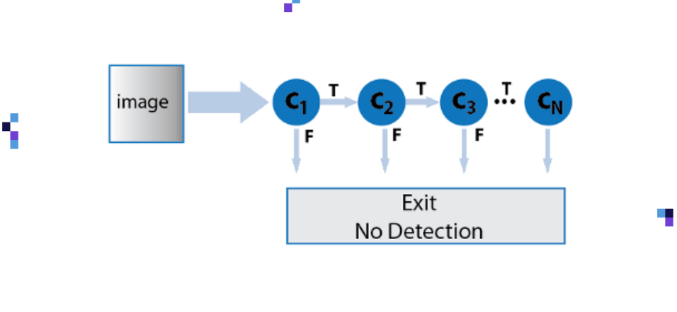

[< 뒤로가기](./README.md)

# Haaracascade Classifier

Haaracascade Classfier은 다음과 같이 구성되어 있습니다.

- Positive Image : 분류대상(face)에 포함 되는 다양한 이미지
- Negative Image : 분류대상에 포함되지 않는 다양한 대상(forest, dog, cat, car and so on)

이렇게 구성된 Image Data Set을 확보하면, `AdaBoost Training Algorithm`을 통해서 분류기 학습을 진행할 수 있습니다. 
해당 AdaBoost Training Algorithm이 분류대상(face)의 세부사항 및 이미지 특성을 학습하게 됩니다. 학습된 특성은 `Feature Selection`으로 정의되게 됩니다. 해당 특성을 통해서 얼굴을 찾기 위해서 이미지의 죄상단 -> 우하단으로 탐색을 진행합니다.

Cascade Classifier은 대상 이미지의 크기에 따라서 Combination의 숫자가 기하 급수적으로 늘어나게 됩니다.

- 조합의 수 = Σ (white-pixels) - Σ (black pixels)

예를 들어, 이미지의 크기가 (24, 24)의 경우 **160,000에 달하는 경의 수를 학습**해야 합니다.

각각의 이미지는 일부의 `Feature Selection`를 시각화한 것으로 조금 더 명확하게 알 수 있습니다. 
지칭을 위해서 각 공간에 인덱스를 부여하고 (가로, 세로)의 순으로 행렬을 표기하겠습니다.

- 가로 1 ~ 5
- 세로 1 ~ 5

(1, 1)의 경우 Eye Selection일 것입니다.  
(1, 3)의 경우 Glabella Selection 일 것입니다.  
(1, 5)의 경우 Forehead Selection 일 것입니다.

즉 단일 이미지에 대한 `Feature Selection` 탐색에 대한 논리로 다시 생각해본다면...

각각의 Feature를 C1, C2, C2, ... Cn으로 표기해본다면 다음과 같을 것입니다. 
하나의 이미지에 대해서, N 개의 Feature 탐색이 이루어질 것입니다. 

각각의 탐색은 모두 True를 조건으로 선형으로 실행되고 있기 때문에, 하나라도 탐색이 이루어지지 않는다면 Face Detection이 이루어지지 않을 것입니다.

