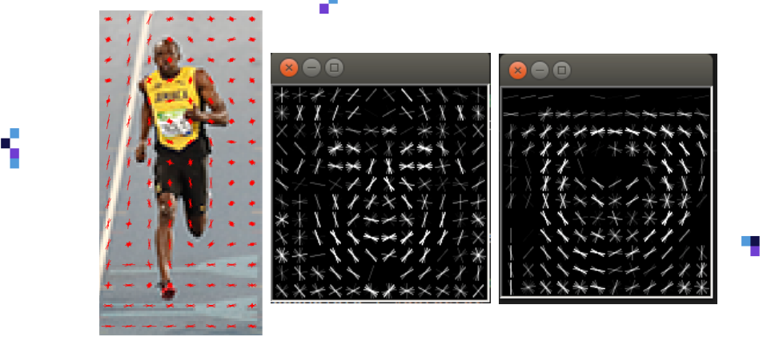

[< 뒤로가기](./README.md)

# HOG Classifier

Histograms of Oriented Gradients Classifier는 다음과 같이 구성되어 있습니다.

- Gradient Magnitude : 색 변화의 크기
- Gradient Direction : 색 변화의 방향성

이렇게 구성된 HOG Classifier은 색의 변화가 큰 경계선을 추출할 수 있습니다. 이는 일종의 `Edge Detection`으로 보아야할 것입니다. 선수의 머리부분을 확대해서 연산된 Gradient Magnitude와 Direction을 보면 다음의 내용을 알 수 있습니다.

- 짙은 갈색의 두피와 연한 회색의 경기장 사이의 Magnitude가 매우 큰 것을 알 수 있습니다.
- 두피만 보았을 때, 어두운 색에서 밝은 색으로 Direcdtion(360 degree)이 가리키고 있는 것을 알수 있습니다.

HOG Classifier은 이 `두 행렬의 연산`으로 계산이 되며, 그 과정은 대략적으로 다음과 같습니다.

- Direction[1, 1] : 연산 행렬의 index와 유사한 형태로 기능합니다.
- Magnitude[1, 1] : 연산 행렬의 value와 유사한 형태로 가능합니다.

아래 그림에서는 20 degree를 간격으로 한 HOG Table이 예시로 나와 있습니다.  
이 경우, Direction이 20의 배수인 (1, 1)은 HOG[80] = 2 으로 들어가 있습니다.  
하지만, Direction이 20의 배수가 아닌 (1,4)은 HOG[0] 과 HOG[20] 에 각각 4 /2 씩 들어가 있습니다.

이러한 과정을 통해 얻은 HOG Table은 다음과 같고 이를 통해서 전체적인 `히스토그램 분포`를 알 수 있습니다.  
잘 만들어진 `히스토그램 분포`라는 전제 하에, 학습된 대상(얼굴)의 히스토그램이 있다면 입력된 이미지(오리)의 히스토그램과의 비교로, 얼굴이 있는지를 감지할 수 있을 것입니다.

이러한 과정은 매우 많은 양의 연산처리를 발생시킵니다.

역시나 대략적으로 표기해보면, 다음과 같을 것입니다.

- 좌측 : 이미지 전체의 벡터의 흐름
- 중앙 : 얼굴 HOG의 최종 결과물
- 우측 : 시계 HOG의 최종 결과물

