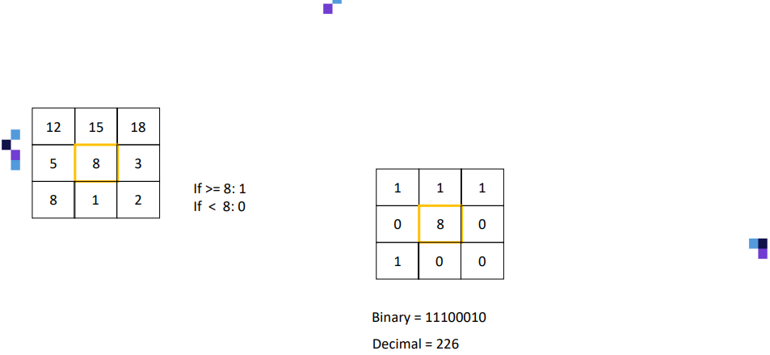
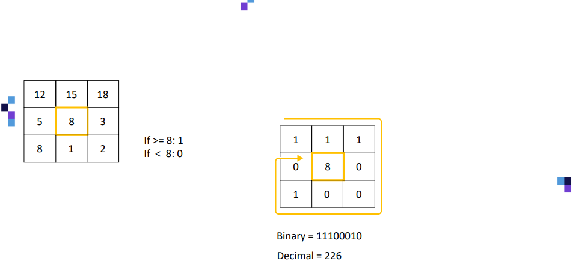
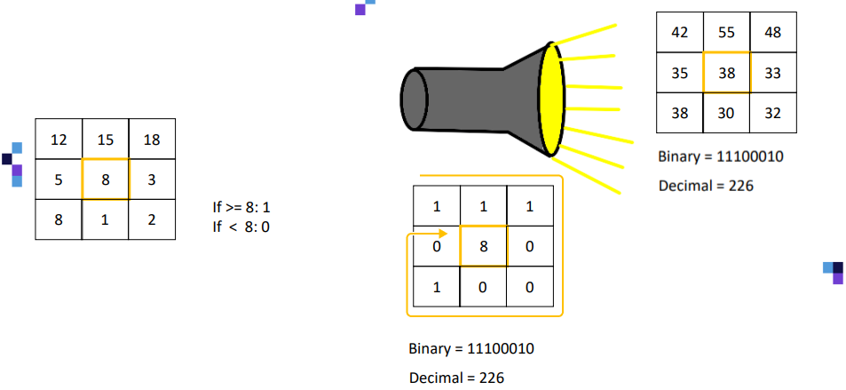
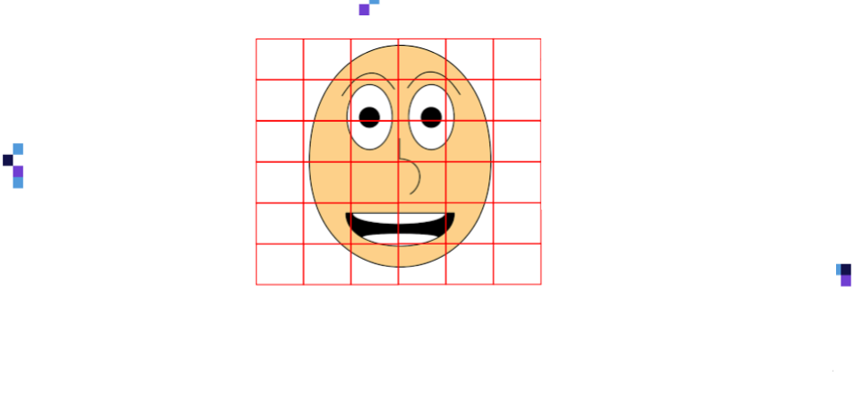
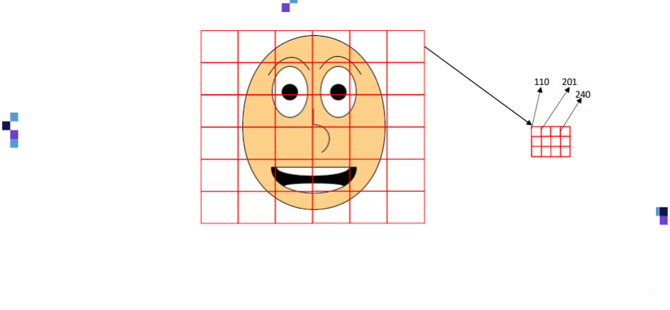
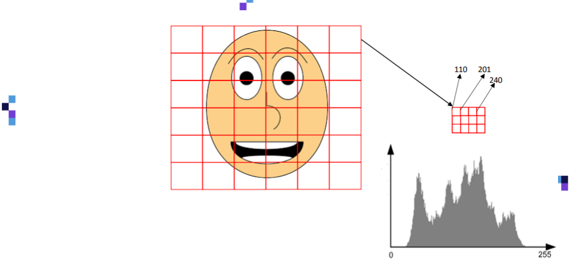
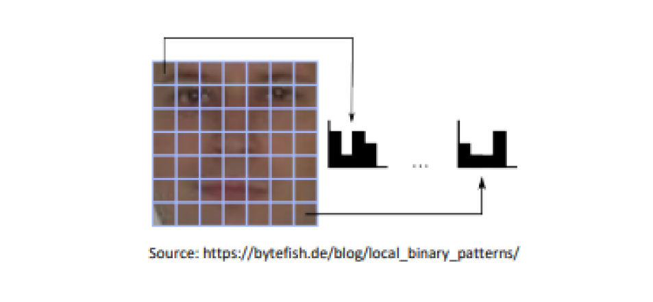
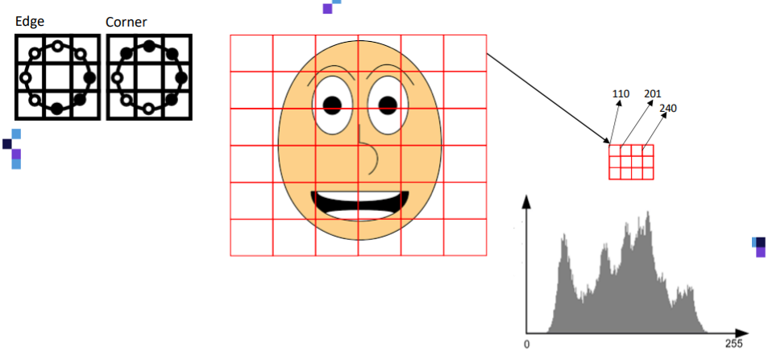

[< 뒤로가기](./README.md)

# LBPH 알고리즘

LBHP : Local Binary Patterns Histograms 

LBHP는 얼굴 인식에 있어서 가장 유명한 알고리즘 중 하나입니다. 
직관적인 아이디어에 대해서 알아보고 OpenCV 라이브러리를 통해서 구현해보겠습니다.

(3, 3) 크기의 이미지가 있다고 할 때, LBHP 알고리즘은 `중앙값 8`을 기준으로 합니다.

- 값이 8보다 크거나 같으면 1을 할당
- 값이 8보다 작다면 0을 할당

이렇게 변환된 값을 `이진수, Binary Value`로 변환하게 됩니다.  
값 행렬의 좌상단부터 시계방향으로 회전하면서 중앙값을 향해서 값을 호출하게 됩니다.

즉, 주어진 이미지의 이진수는  `[1, 1, 1, 0, 0, 0, 1, 0]`입니다.  
이 값을 다시 십진수로 변환하면 `226`이 되며, 이 값을 LBPH 알고리즘에 사용합니다.

LBHP 알고리즘은 `조명을 키고 촬영한 이미지`에 대해서 특히 강력합니다.  
이미지의 밝기가 강해지면, 그 값 또한 증가하게 되어 연산의 크기가 커집니다.  
하지만 LHBP 알고리즘은 중앙값을 기준으로 치환한 이진수를 사용하므로 그 효율성이 탁월해집니다.

실제 존재하는 이미지를 이용해서 살펴보겠습니다.  
얼굴을 포함하고 있는 이미지가 있으면, LBPH 알고리즘은 이 이미지를 여러 개의 정사각형 영역으로 분리합니다.

각각의 정사각형에는 이미지의 일부분이 포함되어 있을 것입니다.

예를 들어, image[5][0]이 다음과 같이 (4, 3)으로 구성되어 있다고 생각해봅시다.  
하나의 영역은 12개의 픽셀로 구성되며, 총  12 * 6 * 6 의 픽셀로 이미지가 구성됩니다.

해당 영역을 히스토그램으로 표기하여 `어떤 색이 얼마나 많은지`를 알아낼 수 있습니다.

실제로 존재하는 얼굴로 간단한 히스토토그램 예시를 보면 다음과 같습니다.  
사람의 얼굴의 각 부분은 고유한 히스토그램을 보여주고 있으므로, 이를 통해서 `얼굴의 특정 부위`를 판별할 수도 있을 것입니다.

즉, 이미지의 Edge, Corne를 감지할 수 있음을 의미합니다.  
각 영역은 얼굴이 없거나, 일부 있거나, 전부 있거나 등과 같을 것입니다.  
이에 따라서 히스토그램 또한 다양하게 분포되고 이를 이용해서 얼굴을 인식할 수 있습니다.

