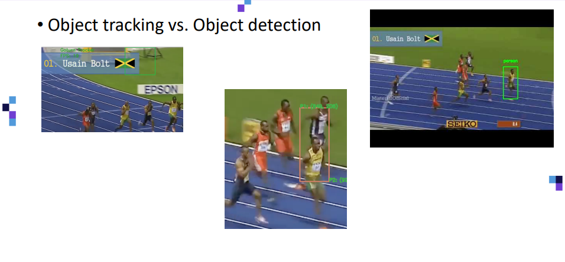

[< 뒤로가기](./README.md)

# Object Tracking 객체 추적

Object Tracking과 Object Detection은 무었이 다를까요?  
때때로, 두 용어를 같은 단어처럼 사용하는데, 주로 만들어진 알고리즘의 구현방법에 대한 **큰 차이점**이 존재합니다.

일반적으로 Object Tracking이 Detection 알고리즘보다 훨씬 빠르고 있습니다.  
그 이유는 해당 알고리즘은 Object Tracking Target의 모습을 이미 알고 있기 때문입니다.

아래 이미지의 우사인 볼트를 Tracking을 하고 있는 모습입니다.

하지만, 움직임이 빠른 동영상은 그 형태가 제대로 기록되어 있지 않습니다. 
이러한 경우 Tracking이 제대로 성공하지 못하는 경우가 발생할 가능성이 있습니다.

극단적으로 보면, 다음과 같이 전혀 다른 곳을 가리키기도 합니다.  
이러한 경우, 다음과 같은 해결방법이 존재합니다.

- [기술] KCF, CSRT 혹은 그 외의 알고리즘으로의 변경으로 해결
- [로직] Object Tracking에 실패하면 Object Detection을 다시 실행

  

또한, 다음과 같이 Face Recognition에서도 활용할 수 있습니다.

동영상에서 얼굴이 가려질 경우, Face Recognition에 실패할 것입니다. 
하지만, 최초의 영상에만 Face Recognition을 실행하고 그 이후에 Object Tracking을 사용한다면, 가려진 얼굴도 추적할 수 있을 것입니다.

물론, 이 또한 급격한 움직임은 잡을 수 없을 것입니다.

자 이제, 다음의 문서를 통해서 기본적인 Tracking Algorithm을 배워봅시다.

- [KCF : Kernal Correlation Filters](./6_Object_Tracking_KCF.md)
- [CSRT : Discriminative Correlation Filters with Channel and Spatial Reliability](./7_Object_Tracking_CSRT.md)