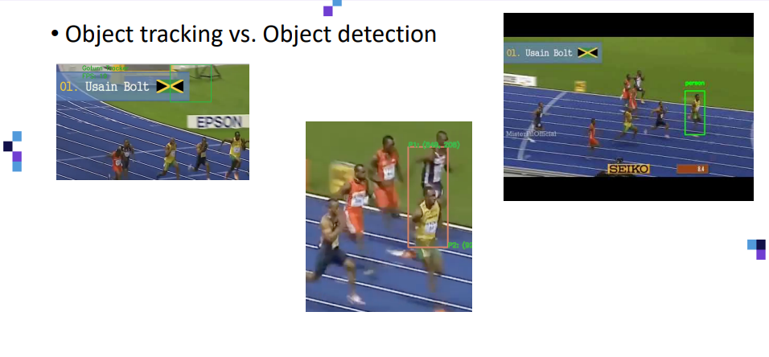
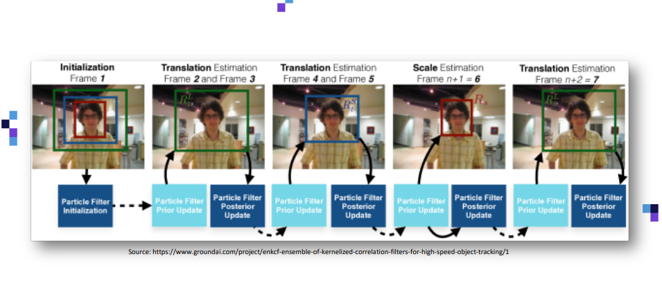

[< 뒤로가기](./README.md)

# KCF Algorihtm

이 알고리즘은 [Object Tracking](./5_Object_Tracking.md)의 일종입니다.

 

KCF는 커널 상관 필터로 다음과 같은 특징이 있습니다.

1. 속도가 매우 빠릅니다.
2. 빠르게 움직이는 피사체를 자주 놓칩니다.

 

KCF 알고리즘의 원리는 다음과 같습니다.  

1. Initialization : 초기 설정
2. Translation Estimation
3. Translation Estimation
4. Scale Estimation
5. Translation Estimation

 

초기 설정 단계에서는 감지해야 할 객체에 대한 초기 설정 또는 정의입니다.

첫 번째 프레임을 통해서 감지해야 할 객체를 선택을 합니다. 
위 그림의 빨간색 프레임을 선택했다고 하면, Particle Filter라는 개념을 사용합니다.

실제 타켓보다 조금 더 큰 경계 영역을 2개 그리게 됩니다.

 

지금부터, 프레임이 진행되면서 각 추정 단계(Estmation)에 조금씩 작은 Particle Filter를 사용합니다.

최종적으로, 초기 설정값까지 감지에 성공하면 전체 Particle Filter의 위치가 `해당 값(이번에 감지된 초기 설정값)`을 이용해서 조정됩니다.
