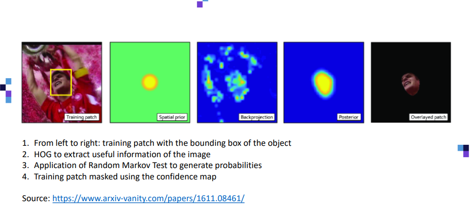

[< 뒤로가기](./README.md)

# CSRT Algorihtm

이 알고리즘은 [Object Tracking](./5_Object_Tracking.md)의 일종입니다.

CSRT에 대한 [추가적인 내용](https://arxiv.org/pdf/1611.08461.pdf)도 한 번 확인해주세요.

 

이름은 채널 및 공간 신뢰도를 통한 구분 상관 필터라는 뜻입니다. 
정확도는 높은 편이지만, 그 속도가 느립니다.

 

이 알고리즘은 다음의 그림의 순서대로 진행되며, 자세한 내용은 이미지 아래를 봐주세요.

1. `Tracking Patch` 사용
2. `HOG Classifier : 그라디언트 기반 히스토그램 분석기` 사용
3. `Random Markov Test : 랜덤 마르코프 테스트` 사용
4. `Confidence Map`을 사용합니다.
5. `Overlayered Patch` 사용

 

 

> Patch는 Computer Vision에서 많이 쓰이는 용어로, 이미지에서 `학습할 대상`, 즉 `감지할 대상`을 의미하는 용어입니다.

 

1- 
첫 번째 단계는 객체의 경계 상자로 객체의 경계 상자로 Patch를 학습시키는 것입니다.

2- 
그 다음은 [Face Detection/HOG Classifier](./3_Face_Detection_HOG_Classifier.md)을 사용하는 것입니다.  
이미지의 중요 정보는 추출하고 나머지는 모두 제거하게 됩니다.  
이를 통해, 박스 안에는 중요 정보만 남게 됩니다.  
최종적으로 HOG Classifier은 이미지의 형태를 찾기 위해서 Edge & Corner를 탐색하여, 위와 같은 동그라미를 그리게 될 것입니다.

3- 
그 다음엔 [Random Markov Test (google 검색 결과)](https://www.google.com/search?q=Random+Markov+Test%EB%9E%80&oq=Random+Markov+Test%EB%9E%80&aqs=chrome..69i57j33i160l3.4577j0j7&sourceid=chrome&ie=UTF-8)을 통해서, 거의 원본과 동일한 형태로 이 사람의 `다음 움직임`이 보입니다.

4- 
그 다음에 [Confidence Map (뉴스 검색 결과)](https://www.samsungsds.com/kr/insights/human_pose.html#:~:text=Confidence%20Map%EC%9D%80%20%ED%8A%B9%EC%A0%95%20%EC%8B%A0%EC%B2%B4,%EA%B0%90%EC%86%8C%ED%95%98%EB%8A%94%20Heatmap%EC%9D%84%20%EB%A7%8C%EB%93%AD%EB%8B%88%EB%8B%A4.)을 이용하여, 위 이미지에서 보는 것처럼 `마스크에 가려진 객체`만 남기게 됩니다.  
이는 `2- 단계`에서 추출한 Edge & Corner와 매우 유사한 형태일 것입니다.

5- 
최종적으로 허공에 둥둥 떠다니는 사람의 얼굴을 얻을 수 있습니다.

더 자세한 내용은 [Discriminative Correlation Filter with Channel and Spatial Reliability](https://www.arxiv-vanity.com/papers/1611.08461/) 포스트를 살펴봐주세요.
