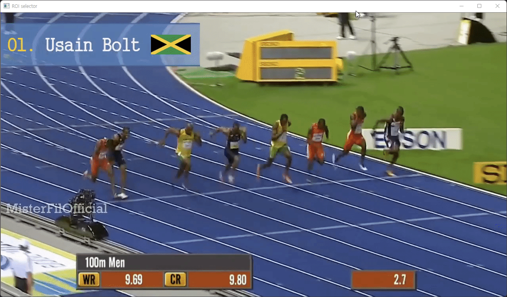

[< 뒤로가기](../../README.md)

# 객체 추적

객체 추적은 대표적으로 다음과 같은 알고리즘이 있고 서로 다른 분야에서 사용될 수 있습니다. 
KCF는 속도가 빠르지만 정확도가 낮고 CSRT는 그 반대입니다.

1. KCF를 이용한 객체 추적 [커널 상관 필터]
2. CSRT 알고리즘을 이용한 객체 추적 [가중 변별 상관 필터]

    <h3>예시) KCF를 이용한 객체 추적</h3>
    
KCF 알고리즘은 몸의 전체밖에 잡지 못합니다. 또한, 빠르게 움직이는 객체의 경우 추적에 실패할 가능성이 높습니다.

    

        

            Initialization
            
        

        

            Detect <code>Entire Body</code>
            
        

    

 

    <h3>예시) CSRT를 이용한 객체 추적</h3>
    
CSRT 알고리즘은 몸 전체 혹은 몸의 일부를 모두 추적할 수 있습니다. 대신 추적 속도가 느립니다.

    

        

            Detect <code>Entire Body</code>
            
        

        

            Detect <code>Parts of Body</code>
            
        

    

- [Read with English](./README.md)

## 파일 리스트

1. [Object Tracking with KCF.ipynb](./1_Object_Tracking_with_KCF.ipynb)
2. [Object Tracking with CSRT.ipynb](./2_Object_Tracking_with_CSRT.ipynb)
3. [Object Tracking Practice.py](./3_Object_Tracking_Practice.py)
